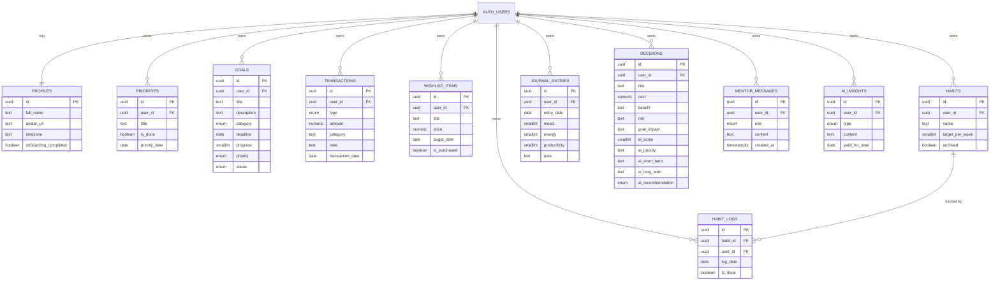

# Entity Relationship Diagram — Surya Center

Semua tabel domain memiliki `user_id` yang mereferensi `auth.users(id)` milik
Supabase Auth, dan diproteksi Row Level Security (`auth.uid() = user_id`).

## Catatan Desain

- `habit_logs` punya unique constraint `(habit_id, log_date)` — satu entri
  per habit per hari, di-`upsert` saat toggle checklist (idempotent).
- `journal_entries` punya unique constraint `(user_id, entry_date)` — satu
  entri jurnal per hari, juga di-`upsert`.
- `ai_insights` adalah **cache layer**, bukan tabel domain: unique constraint
  `(user_id, type, valid_for_date)` memastikan Gemini hanya dipanggil sekali
  per hari untuk insight/motivasi, menghemat kuota API.
- View `v_monthly_money_summary` mengagregasi `transactions` per bulan per
  user untuk grafik di Money Center, tanpa perlu materialized view.
